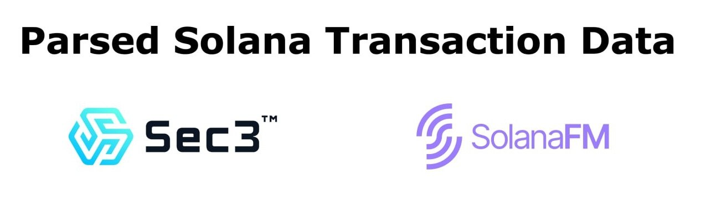

With financial backing from the [Solana Foundation](https://solana.org),
[Sec3](https://sec3.dev) collaborated with [SolanaFM](https://solana.fm/) to
curate this dataset containing parsed transactions from the Solana Mainnet
Beta. This dataset offers access to non-voting transactions on the Solana
mainnet for September 2023, and deciphers transactions. Transactions related to
voting are excluded to conserve storage space.

## Data Range

The data contains transactions from slot
[214,824,000](https://explorer.solana.com/block/214824000) (8/31/2023 at
23:55:16 UTC) to [220,802,999](https://explorer.solana.com/block/220802999)
(10/1/2023 at 00:01:42 UTC).

## Schema

The structure of each file aligns with the output of Solana's official RPC
`getBlock` method, with enhancements in instruction data parsing. If
instruction data is parseable, it includes a `parsed` field with subfields:

- `type`: Specifies the instruction name.
- `info`: Contains the argument of the instruction.

If the instruction data cannot be parsed, the original `data` field is
retained, containing base58 encoded data.

PublicKeys and BigInts are stored as strings.

## Download instructions

### Prerequisites

Before you begin the download process, please ensure you meet the following
requirements:

- Storage Requirements

The data is packaged in ZIP files, with each file containing ~1000 slots of
transactions and being ~150MB in size. If you intend to download the entire
dataset for a 30-day period, the total file size will be approximately 900GB.
Please ensure you have sufficient disk space available.

### Download

#### Individual Slots

If you need the transaction data for specific slots, you can download them
directly based on their slot numbers.

- Calculating File Name

Round down the slot number to the nearest thousand to determine the file name.
For example, the data for slot number `214825123` would be stored in
`214825000.zip`.

- Finding the URL

Once you have identified the file name, locate the corresponding complete URL
(in `https://`) in the provided
[URL list](https://github.com/coderrect-inc/sec3-solana-txs/blob/main/urls.txt).

- Downloading

To download the file, Fetch the URL directly. For example:

```sh
DOWNLOAD_URL=<Download URL>
curl --remote-name "${DOWNLOAD_URL}"
```

#### Complete Dataset

If you require the full dataset:

- Save the URL List

First, ensure you have the `urls.txt` file, which contains all the download
URLs, saved to your local machine. This file can be found in the cloned repo or
directly downloaded from
[GitHub](https://github.com/coderrect-inc/sec3-solana-txs/blob/main/urls.txt).

- Download the Dataset

Given that the full dataset comprises 5979 ZIP files, we recommend using a
download tool or command that supports parallel downloading for efficiency.
Below are the example commands for using `aria2` and `curl` as references.

  - Using [`aria2`](https://aria2.github.io/)

    ```sh
    aria2c \
      --input-file=urls.txt \
      --max-concurrent-downloads=5 \
      --continue
    ```

  - Using `curl` + `xargs`

    ```sh
    cat urls.txt | \
      xargs \
        --max-procs=5 \
        --max-args=1 \
        curl --remote-name
    ```

## Additional Resources

- SolanaFM has released
  [Solana Data Parser for Developers](https://github.com/solana-fm/explorer-kit).


## Contact Us

- For any issues or support, please contact us at contact@sec3.dev.
